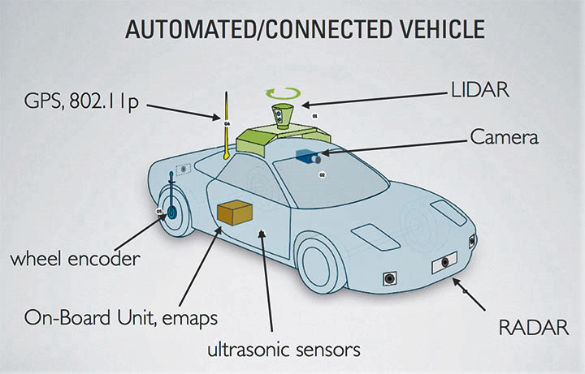
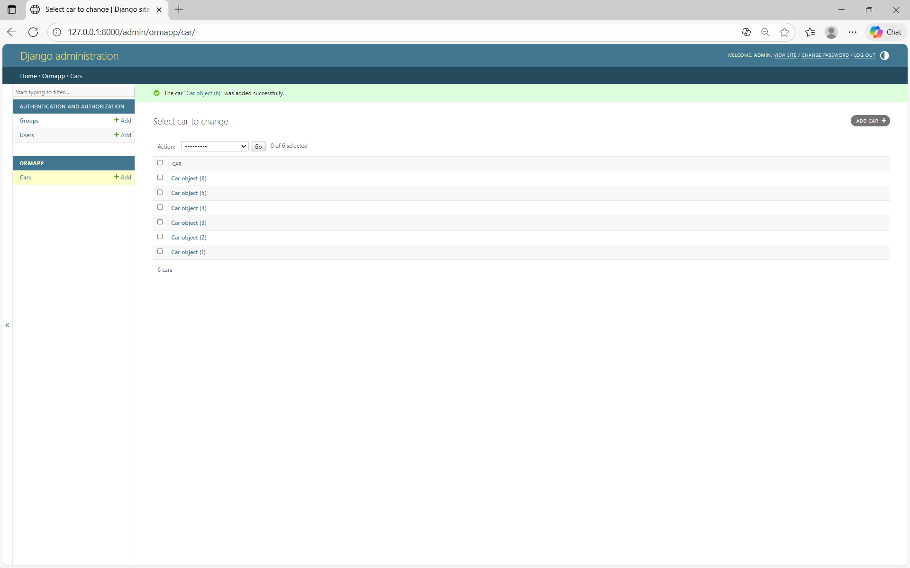

# Ex02 Django ORM Web Application
## Date: 

## AIM
To develop a Django application to store and retrieve data from Car Inventory Database using Object Relational Mapping(ORM).

## ENTITY RELATIONSHIP DIAGRAM


## DESIGN STEPS

### STEP 1:
Clone the problem from GitHub

### STEP 2:
Create a new app in Django project

### STEP 3:
Enter the code for admin.py and models.py

### STEP 4:
Execute Django admin and create details for 10 books

## RELATIONSHIP DIAGRAM

## PROGRAM
## MODELS.PY
```
from django.db import models

class Car(models.Model):
    car_id = models.IntegerField(primary_key=True)
    brand = models.CharField(max_length=20)
    model = models.CharField(max_length=20)
    year = models.DateField()
    price = models.IntegerField()
```

## ADMIN.PY
```
from django.contrib import admin
from . models import Car
admin.site.register(Car)
class carAdmin(admin.ModelAdmin):
    list_display=('car_id','brand','model','year','price')
```


## OUTPUT


## RESULT
Thus the program for creating a database using ORM hass been executed successfully.
