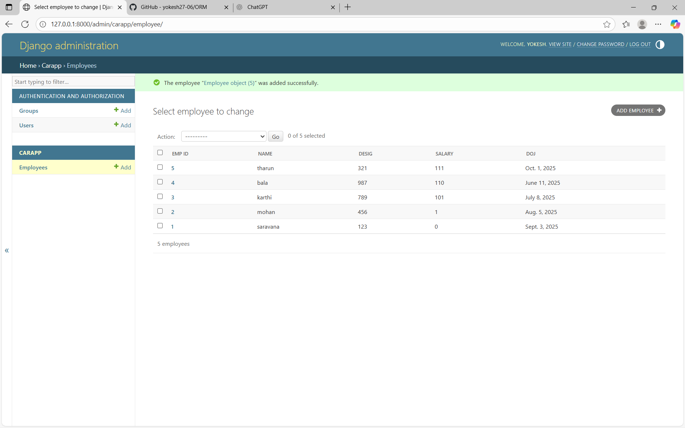

# Ex02 Django ORM Web Application
## Date: 

## AIM
To develop a Django application to store and retrieve data from Car Inventory Database using Object Relational Mapping(ORM).

## ENTITY RELATIONSHIP DIAGRAM


## DESIGN STEPS

### STEP 1:
Clone the problem from GitHub

### STEP 2:
Create a new app in Django project

### STEP 3:
Enter the code for admin.py and models.py

### STEP 4:
Execute Django admin and create details for 10 books

## PROGRAM
## MODELS.PY
~~~
from django.db import models
from django.contrib import admin

# Create your models here.
class Employee(models.Model):
    emp_id = models.IntegerField(primary_key=True)
    name = models.CharField(max_length=50)
    desig = models.CharField(max_length=50)
    salary = models.IntegerField()
    doj = models.DateField()

class EmployeeAdmin(admin.ModelAdmin):
    list_display = ('emp_id','name','desig','salary','doj')```
~~~

## ADMIN.PY
```
from django.contrib import admin
from . models import Employee, EmployeeAdmin

# Register your models here.
admin.site.register(Employee, EmployeeAdmin)

```


## OUTPUT




## RESULT
Thus the program for creating a database using ORM hass been executed successfully
